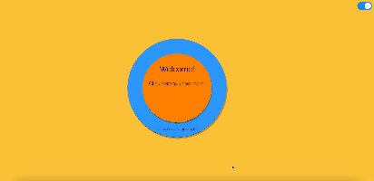

# My Simpilistic Intearative Resume

This is a project I started to learn basics of Web Development using vanilla JS, HTML and CSS. While buidling the project I have tried to achieve UI/UX design principles in terms of colors of choice, intuitive interaction, JS and CSS transition effects. Additionally I tried to achieve what could be called conceptually closer to Single Page Application with a fixed frontend and data being updated from a json file upon user interaction.

## How to run this project?

The project is not deployed yet as a functioning website. In order to run the project and see what I build download the Github repo, open in VS code and use VS code live server extension to run the home-page.html and interact with it. The project is not yet optimized for Mobile and should be run only desktop devices.

**Check the gif below to have a glimpse**

## Core Insights and Functioning about the project

UI mostly stays static in form of a sinlge web page and content with in the page is updated on user interaction with the help of javascript

- modular programming in Javascript
- Theme Switcher using JS and CSS
- transition-effects.js to take care of transition of circle options
- option-flow.js to handle navigation of options
- template-engine.js to load content from data.json
- data.json contains all the website data
- app.js which loads the above modules and act as entry point for the website
